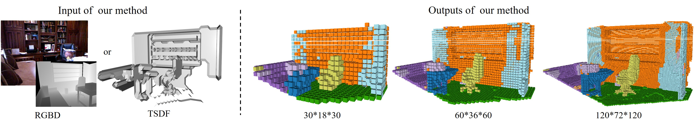
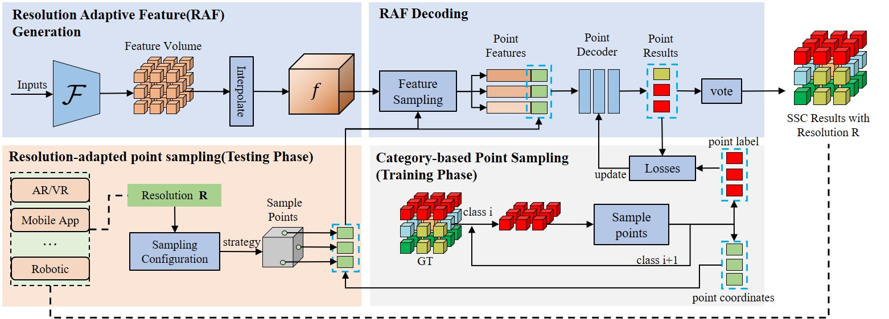

# ReS-SSC



This repository contains the code to reproduce the results from the paper
Resolution-switchable 3D Semantic Scene Completion

## Method



## Requirements

make sure the following packages are correctly installed in your python environment:

- pytorch≥1.4.0
- torch_scatter
- open3d

If you use other versions of PyTorch or CUDA, be sure to select the corresponding version of torch_scatter.

## Dataset

The repackaged data can be downloaded via  [Google Drive](https://drive.google.com/drive/folders/15vFzZQL2eLu6AKSAcCbIyaA9n1cQi3PO?usp=sharing) or [BaiduYun(Access code:lpmk)](https://pan.baidu.com/s/1mtdAEdHYTwS4j8QjptISBg).

Thanks to [waterljwant](https://github.com/waterljwant/SSC) for providing the repackaged data

The repackaged data includes:

```python
rgb_tensor   = npz_file['rgb']		# pytorch tensor of color image
depth_tensor = npz_file['depth']	# pytorch tensor of depth 
tsdf_hr      = npz_file['tsdf_hr']  	# flipped TSDF, (240, 144, 240)
tsdf_lr      = npz_file['tsdf_lr']  	# flipped TSDF, ( 60,  36,  60)
target_hr    = npz_file['target_hr']	# ground truth, (240, 144, 240)
target_lr    = npz_file['target_lr']	# ground truth, ( 60,  36,  60)
position     = npz_file['position']	# 2D-3D projection mapping index
```

### Train

To train our point decoder, first you need to pre-train the encoder. You can refer to [waterljwant](https://github.com/waterljwant/SSC) to pre-train AICNet or DDRNet. Or you can use our pre-trained encoders (can be found in the "Eval"), then train our point decoder by running the following script

```
bash ./res_train.sh
```

Put the pre-trained model in the folder you want, then modify the 'pretrain-en' parameter in the script to your storage path. 

## Eval

To eval our method and reproduce the results reported in the paper, you may download our pretrained model on NYUCAD dataset:

|              | (30,18,30) | (60,36,60) | (120,72,120) |
| :----------: | :--------: | :--------: | :----------: |
|  [DDRNet]()  |    34.5    |    41.5    |     32.9     |
|  [AICNet]()  |    36.8    |    43.1    |     33.8     |
| [Ours-DDR]() |    40.7    |    42.6    |     38.0     |
| [Ours-AIC]() |  **43.0**  |  **44.7**  |   **40.5**   |

then, you may run the following instructions to eval our method

```
python eval.py --scale 8 --model aic --sample_mode vote --point_to_extent 15 --resume PRETRAIN_MODEL --visualize --base_folder VIS_RES_TO_SAVE
```

The meanings of the parameters are as follows

- **scale** : Downsampling scale, the original resolution is (240,144,240), downsampling 8 times means the result output is (30,18,30)
- **model** : Using AIC or DDR as our encoder
- **sample_mode** : We provide "vote" and "center".  Please refer to the paper for details of which mode to use.
- **point_to_extent** : If you use "vote" mode, the number of points sampled in a voxel grid is determined by this parameter.  It Does not work for "center" mode
- **resume** : Path of pre-trained models.
- **visualize** : For visualizing the results.
- **base_folder** : Where to save the visualizing results.

